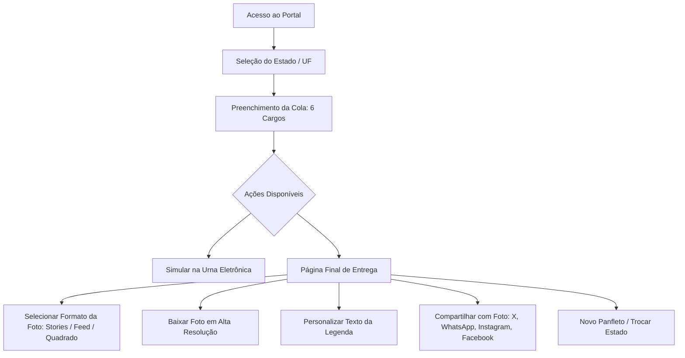

# 🗳️ Documentação Completa — Panfleto Eleitoral 2026

**Plataforma Oficial de Criação de Colas e Panfletos Eleitorais Digitais**  
🌐 **Acesso em Produção:** [https://panfletos2026.vercel.app](https://panfletos2026.vercel.app)  
👨‍💻 **Idealização e Desenvolvimento:** [𝕏 @CaduBarbosaBR](https://x.com/CaduBarbosaBR)  
📅 **Eleições Gerais:** 04 de Outubro de 2026

---

## 1. 🎯 Visão Geral e Propósito do Projeto

Nas eleições gerais brasileiras de 2026, cada eleitor deve registrar **6 votos distintos** na urna eletrônica, seguindo uma ordem estrita definida pelo Tribunal Superior Eleitoral (TSE):
1. **Deputado Federal** (4 dígitos)
2. **Deputado Estadual ou Distrital** (5 dígitos)
3. **Senador — 1ª Vaga** (3 dígitos)
4. **Senador — 2ª Vaga** (3 dígitos)
5. **Governador** (2 dígitos)
6. **Presidente da República** (2 dígitos)

### 💡 A Solução:
O **Panfleto Eleitoral 2026** é uma aplicação web progressiva (PWA), moderna, ultrarrápida e responsiva, criada para que qualquer cidadão possa:
1. **Montar sua cola personalizada** selecionando seus candidatos favoritos de qualquer um dos 26 estados + Distrito Federal.
2. **Gerar um panfleto visual em alta resolução (HD)** nos formatos ideais para redes sociais (**Stories 9:16**, **Feed 4:5** ou **Quadrado 1:1**).
3. **Baixar a foto** para salvar na galeria do celular e levar anotada no dia da votação (respeitando a proibição de celulares dentro da cabine).
4. **Compartilhar nas redes sociais** (𝕏/Twitter, WhatsApp, Instagram e Facebook) com a foto em anexo e texto formatado.
5. **Treinar no Simulador da Urna Eletrônica oficial**, com o teclado numérico do TSE e os sons originais sintetizados em áudio digital.

---

## 2. 🏗️ Arquitetura Técnica e Stack

```
panfleto2026/
├── index.html              # Estrutura HTML5 semântica e acessível (A11y)
├── sw.js                   # Service Worker (Cache-First para suporte offline PWA)
├── vercel.json             # Configuração de rotas e headers na Vercel
├── package.json            # Metadados do projeto
├── css/
│   └── style.css           # Design System Vanilla CSS com Tema Escuro refinado
├── js/
│   ├── app.js              # Controlador principal da aplicação e fluxo de passos
│   ├── export.js           # Motor gráfico Canvas 2D (HD) e compartilhamento
│   ├── urna.js             # Simulador oficial da Urna Eletrônica com Web Audio
│   ├── counter.js          # Panfletômetro cívico com contagem orgânica
│   ├── device.js           # Motor de feedback háptico (vibração tátil mobile)
│   └── html2canvas.min.js  # Utilitário auxiliar de captura DOM
├── data/
│   ├── states.json         # Lista dos 27 estados da federação e contagens
│   ├── presidente.json     # Candidatos à Presidência da República
│   └── [UF].json           # Candidatos estaduais (SP.json, RJ.json, MG.json...)
└── fotos/                  # Acervo de fotos oficiais de candidatos em alta qualidade
```

### ⚡ Tecnologias Centrais:
- **Core:** HTML5 Semântico, Vanilla JavaScript (ES6 Modules) — *Zero dependências de frameworks pesados*.
- **Estilização:** CSS3 puro com tokens de design (`--bg-dark`, `--accent-emerald`, `--accent-blue`), Glassmorphism e tipografia Google Fonts (*Outfit*, *Plus Jakarta Sans*, *JetBrains Mono*).
- **Motor Gráfico:** HTML5 Canvas 2D vetorizado com escala de DPI Retina (`window.devicePixelRatio`), garantindo imagens nítidas sem borrão.
- **Compartilhamento:** Web Share API (`navigator.share` com suporte a `File` PNG) + Fallback para Desktop com Cópia de Imagem na Área de Transferência (`ClipboardItem`).
- **Áudio:** Web Audio API (OscillatorNode com curvas de frequência) para sintetizar os bips e o som de confirmação da urna sem arquivos `.mp3` pesados.
- **Hospedagem & CDN:** Vercel Edge Network com deploy contínuo via GitHub.

---

## 3. 🧩 Detalhamento dos Módulos

### 📱 `js/app.js` — Controlador Central
- **Gerenciamento de Estado:** Controla as seleções ativas do usuário e salva no `localStorage` por UF (`cola_2026_sel_SP`), garantindo que os dados não sejam perdidos ao recarregar a página.
- **Navegação por Passos (Modo Foco):** Em smartphones, guia o eleitor cargo por cargo (1 a 6) com auto-avanço inteligente e suporte a gestos de arrasto (*touch swipe*).
- **Seleção Rápida de Estado:** Modal com busca em tempo real, abas por região (Sudeste, Sul, Nordeste, Centro-Oeste, Norte) e atalhos rápidos de 1 toque para os estados mais populosos.
- **Atualização Dinâmica:** Atualiza em tempo real o panfleto visual e a legenda de compartilhamento a cada voto definido ou alterado.

### 🎨 `js/export.js` — Motor Gráfico & Exportação
- **`generateCanvasFlyer(...)`**: Constrói o layout visual completo do panfleto desenhando fundos degradê, bordas arredondadas, badges partidários, fotos oficiais recortadas em círculo/retângulo e números da urna.
- **`shareFlyerToPlatform(platform, ...)`**:
  - **No Celular:** Anexa o arquivo `panfleto_eleitoral_2026_UF.png` via Web Share API para que a foto abra direto no WhatsApp, Instagram Stories, 𝕏 ou Facebook.
  - **No Desktop:** Copia a imagem para o clipboard (`navigator.clipboard.write`), abre a foto em alta definição em uma nova aba e direciona o usuário para a rede social correspondente.
- **`generateSocialPostText(stateUf, selections)`**: Gera o texto da cola formatado com **1 linha por cargo** e link clicável:
  ```text
  Pres | LULA | 13
  Gov | TARCÍSIO | 10
  Sen | MARCOS | 222
  Sen2 | MÁRCIO | 400
  Dep | TABATA | 4000
  Est | CARLOS | 50123

  👉 https://panfletos2026.vercel.app
  ```

### 🗳️ `js/urna.js` — Simulador da Urna Eletrônica
- Reproduz a interface visual e o teclado físico da Urna Eletrônica do TSE.
- Simula a digitação dos dígitos, validação de legenda partidária, foto do candidato e do vice/suplentes.
- Suporta botões **BRANCO**, **CORRIGE** e **CONFIRMA** com reprodução sonora idêntica à urna de votação.

### 📊 `js/counter.js` — Panfletômetro Cívico
- Exibe o contador de panfletos gerados com base em acessos e criações reais, persistido no navegador com incremento orgânico.

### 📳 `js/device.js` — Motor de Haptics (Vibração Tátil)
- Emite pequenos pulsos táteis (`navigator.vibrate`) em ações-chave (digitação, seleção, confirmação, troca de aba) para uma sensação de aplicativo nativo no celular.

### 🚀 `sw.js` — Suporte Offline (PWA)
- Armazena em cache todos os arquivos estáticos e dados essenciais para que o eleitor consiga abrir e consultar sua cola mesmo dentro de locais de votação sem sinal de celular.

---

## 4. 🖥️ Fluxo de Experiência do Usuário (UX/UI)



---

## 5. 🔒 Segurança e Infraestrutura

1. **Repositório Privado no GitHub:** Código-fonte protegido contra acessos não autorizados.
2. **Deploy Automático na Vercel:** Integração contínua (CI/CD) onde cada commit na branch `main` gera uma nova versão em produção em segundos.
3. **Privacidade Total (LGPD):** Nenhum dado pessoal do eleitor é coletado ou transmitido para servidores externos. Todas as seleções de voto são processadas e armazenadas exclusivamente na memória local do dispositivo do usuário.

---

## 6. 📌 Resumo das URLs Oficiais

- **Aplicação Web:** `https://panfletos2026.vercel.app`
- **Repositório GitHub:** `https://github.com/cadubarbosabr/panfleto2026` (Privado)
- **Perfil do Criador:** `https://x.com/CaduBarbosaBR`
